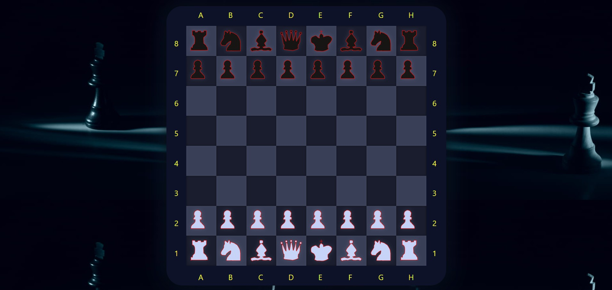
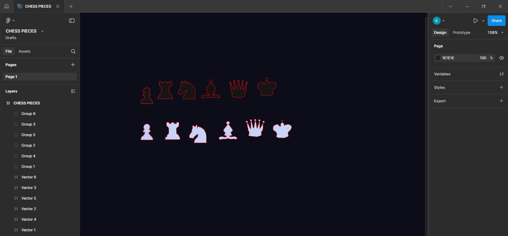

# ♟️ Chess With Kunal 

A draggable Chessboard UI built using **HTML**, **CSS**, and **JavaScript**. Pieces can be moved freely and captured, just like on a physical board.

No game rules or move validation yet — this is a **UI-only project**, and as I learn more in full-stack development, I plan to add logic, AI, multiplayer, and more!

## 🖼️ Preview

## 🎨 Custom Chess Piece Designs

All the chess pieces used in this project were **designed by me using Figma**.  
This allowed for full creative control over the look and consistency of the UI.

Here's a preview of the designs:

> *(You can find the SVG versions in the `chess_pieces/` folder.)*

## 📂 Project Structure

- `index.html` — Main HTML file
- `CSS/style.css` — Styling
- `JS/chess.js` — Logic for dragging/dropping pieces
- `chess_pieces/` — SVG files for each chess piece
- `Screenshot_project_chess.jpg` — Project preview image

## 🚀 Future Plans

- Add legal chess rules and logic
- Move validation
- Game timer and player turns
- Local multiplayer / AI opponent
- Save/load game state
- Full-stack backend integration

---

Made with ❤️ by Kunal
